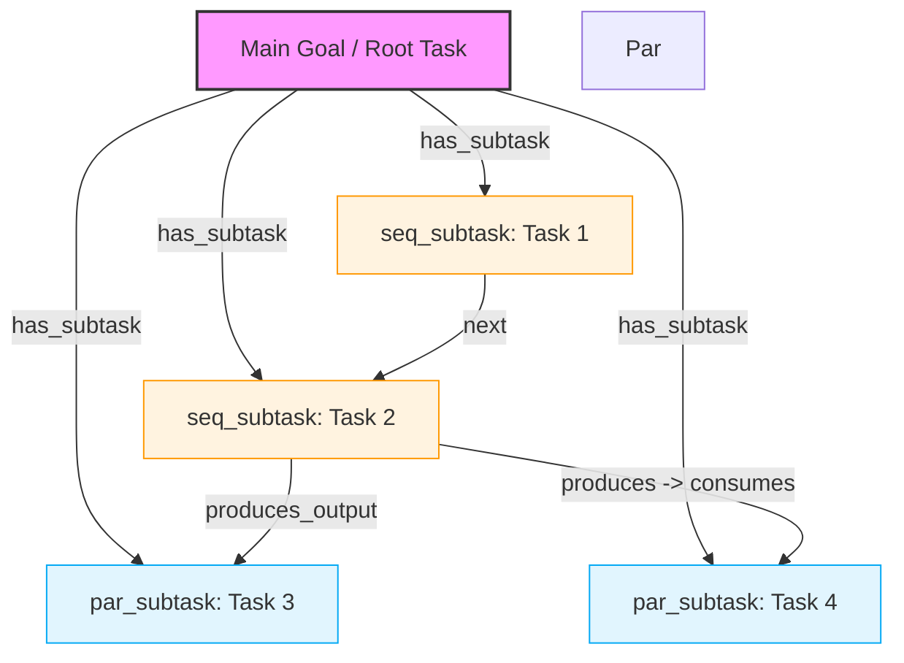

# WORKFLOW AGENT

```mermaid
graph TD
    %% Root Goal Node
    Goal[Main Goal / Root Task]

    %% has_subtask edges point directly to the specific subtask type nodes
    Goal -->|has_subtask| Seq1[seq_subtask: Task 1]
    Goal -->|has_subtask| Seq2[seq_subtask: Task 2]
    Goal -->|has_subtask| Par1[par_subtask: Task 3]
    Goal -->|has_subtask| Par2[par_subtask: Task 4]

    %% Sequential Execution Flow
    Seq1 -->|next| Seq2

    %% Allowed Data Flow: Sequential feeding Parallel But NOT Parallel Feeding Sequential
    Seq2 -->| produces_output | Par1
    Seq2 -->|produces -> consumes| Par2

    Par


    %% Styling Elements
    style Goal fill:#f9f,stroke:#333,stroke-width:2px
    style Seq1 fill:#fff3e0,stroke:#ff9800
    style Seq2 fill:#fff3e0,stroke:#ff9800
    style Par1 fill:#e1f5fe,stroke:#03a9f4
    style Par2 fill:#e1f5fe,stroke:#03a9f4

```
